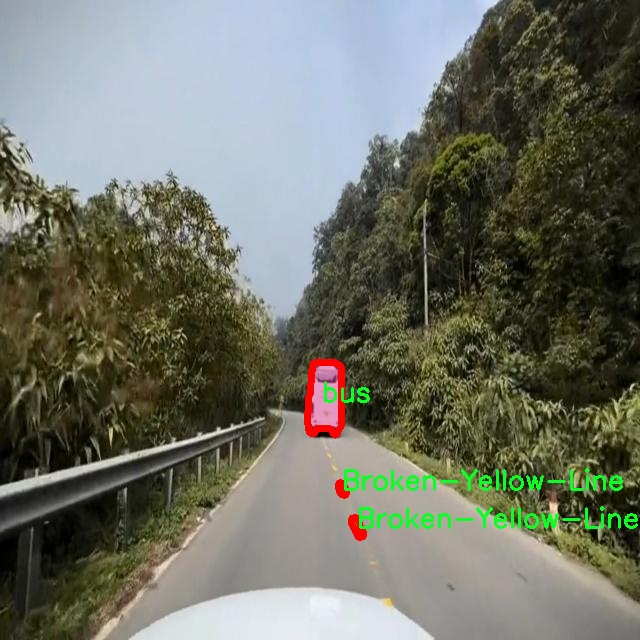

# 交通标线与车辆分割系统源码＆数据集分享
 [yolov8-seg-C2f-Parc＆yolov8-seg-vanillanet等50+全套改进创新点发刊_一键训练教程_Web前端展示]

### 1.研究背景与意义

项目参考[ILSVRC ImageNet Large Scale Visual Recognition Challenge](https://gitee.com/YOLOv8_YOLOv11_Segmentation_Studio/projects)

项目来源[AAAI Global Al lnnovation Contest](https://kdocs.cn/l/cszuIiCKVNis)

研究背景与意义

随着城市化进程的加快，交通管理面临着前所未有的挑战。交通标线作为道路交通管理的重要组成部分，承担着引导和规范车辆行驶的重要职责。然而，传统的交通标线检测方法往往依赖于人工标注和简单的图像处理技术，难以满足实时性和准确性的要求。因此，基于深度学习的自动化交通标线与车辆分割系统应运而生，成为提高交通管理效率的重要手段。

YOLO（You Only Look Once）系列模型以其高效的实时目标检测能力，广泛应用于各类计算机视觉任务。YOLOv8作为该系列的最新版本，具备更强的特征提取能力和更高的检测精度，能够在复杂的交通场景中实现高效的目标识别与分割。通过对YOLOv8的改进，可以进一步提升其在交通标线与车辆分割任务中的表现，特别是在处理多种类交通标线和不同类型车辆的情况下。

本研究所使用的数据集“test_10k”包含2100幅图像，涵盖了9个类别的交通标线和车辆。这些类别包括多种类型的交通标线（如断白线、断黄线、双实黄线等）以及不同类型的车辆（如公交车、轿车、摩托车和卡车）。该数据集的多样性和丰富性为模型的训练和评估提供了良好的基础，使得研究能够在不同的交通场景中进行有效的测试和验证。

在交通安全日益受到重视的背景下，基于改进YOLOv8的交通标线与车辆分割系统的研究具有重要的现实意义。首先，该系统能够实时识别和分割交通标线及车辆，为智能交通系统提供关键的数据支持，帮助交通管理部门及时发现和处理交通违规行为，降低交通事故发生率。其次，通过提高交通标线的识别精度，可以为自动驾驶技术的发展提供更为可靠的环境感知能力，推动智能驾驶的安全性和可靠性。

此外，随着深度学习技术的不断进步，交通标线与车辆分割的研究也为计算机视觉领域的其他应用提供了借鉴。例如，在城市规划、智能监控和交通流量分析等方面，相关技术的进步将促进更为智能化的城市交通管理体系的建立。因此，本研究不仅具有学术价值，还有助于推动相关技术在实际应用中的落地。

综上所述，基于改进YOLOv8的交通标线与车辆分割系统的研究，不仅是对现有交通管理技术的有益补充，更是推动智能交通系统发展的重要一步。通过深入探讨和分析交通标线与车辆的分割技术，能够为未来的交通安全和城市管理提供更为有效的解决方案。

### 2.图片演示


##### 注意：由于此博客编辑较早，上面“2.图片演示”和“3.视频演示”展示的系统图片或者视频可能为老版本，新版本在老版本的基础上升级如下：（实际效果以升级的新版本为准）

  （1）适配了YOLOV8的“目标检测”模型和“实例分割”模型，通过加载相应的权重（.pt）文件即可自适应加载模型。

  （2）支持“图片识别”、“视频识别”、“摄像头实时识别”三种识别模式。

  （3）支持“图片识别”、“视频识别”、“摄像头实时识别”三种识别结果保存导出，解决手动导出（容易卡顿出现爆内存）存在的问题，识别完自动保存结果并导出到tempDir中。

  （4）支持Web前端系统中的标题、背景图等自定义修改，后面提供修改教程。

  另外本项目提供训练的数据集和训练教程,暂不提供权重文件（best.pt）,需要您按照教程进行训练后实现图片演示和Web前端界面演示的效果。

### 3.视频演示

[3.1 视频演示](https://www.bilibili.com/video/BV1wG15YwESL/)

### 4.数据集信息展示

##### 4.1 本项目数据集详细数据（类别数＆类别名）

nc: 9
names: ['Broken-White-Line', 'Broken-Yellow-Line', 'Double-Solid-Yellow-Lines', 'Solid-White-Line', 'Solid-Yellow-Line', 'bus', 'car', 'motorcycle', 'truck']


##### 4.2 本项目数据集信息介绍

数据集信息展示

在本研究中，我们使用了名为“test_10k”的数据集，旨在训练和改进YOLOv8-seg模型，以实现对交通标线与车辆的高效分割。该数据集包含丰富的标注信息，涵盖了多种交通标线和车辆类型，为模型的训练提供了坚实的基础。具体而言，该数据集的类别数量为9，类别列表包括：Broken-White-Line（破损白线）、Broken-Yellow-Line（破损黄线）、Double-Solid-Yellow-Lines（双实黄线）、Solid-White-Line（实白线）、Solid-Yellow-Line（实黄线）、bus（公交车）、car（小汽车）、motorcycle（摩托车）和truck（卡车）。这些类别的选择不仅反映了交通标线的多样性，也涵盖了日常交通中常见的各种车辆类型，确保了数据集的全面性和实用性。

在交通标线方面，数据集中的破损和完整标线类别为模型提供了必要的对比信息，使其能够在不同的环境条件下有效识别和分割交通标线。例如，破损的白线和黄线通常出现在城市道路或乡村小路上，可能由于时间的推移或天气的影响而出现模糊不清的情况。这种情况在实际应用中非常常见，因此，模型必须具备识别这些破损标线的能力，以确保交通安全和有效的交通管理。同时，双实黄线和实白线则代表了明确的交通规则，模型在识别这些标线时，能够帮助驾驶员遵循交通法规，减少交通事故的发生。

在车辆类别方面，数据集涵盖了公交车、小汽车、摩托车和卡车等多种类型的车辆。这些车辆在城市交通中扮演着不同的角色，各自具有不同的尺寸、形状和行驶特性。通过对这些车辆的分割，模型能够更好地理解交通场景的复杂性，进而提高对交通流量的分析能力。例如，公交车通常在特定的车道上行驶，识别其位置和运动轨迹对于优化公共交通系统至关重要。而小汽车和摩托车则可能在道路上穿插行驶，模型需要具备实时识别和跟踪的能力，以确保交通流的顺畅。

此外，数据集的规模也为模型的训练提供了丰富的样本，10,000个样本的数量能够有效地提高模型的泛化能力，减少过拟合的风险。在训练过程中，模型将通过大量的标注数据学习不同类别的特征，从而在实际应用中实现高效的分割与识别。随着数据集的不断扩展和更新，模型的性能有望得到进一步提升，能够适应更复杂的交通场景。

综上所述，“test_10k”数据集为改进YOLOv8-seg的交通标线与车辆分割系统提供了丰富的训练资源，其多样的类别和大量的样本将为模型的性能提升奠定坚实的基础。通过对交通标线和车辆的精确分割，研究将为智能交通系统的发展贡献重要的技术支持，推动交通管理的智能化和自动化进程。





### 5.全套项目环境部署视频教程（零基础手把手教学）

[5.1 环境部署教程链接（零基础手把手教学）](https://www.bilibili.com/video/BV1jG4Ve4E9t/?vd_source=bc9aec86d164b67a7004b996143742dc)


[5.2 安装Python虚拟环境创建和依赖库安装视频教程链接（零基础手把手教学）](https://www.bilibili.com/video/BV1nA4VeYEze/?vd_source=bc9aec86d164b67a7004b996143742dc)

### 6.手把手YOLOV8-seg训练视频教程（零基础小白有手就能学会）

[6.1 手把手YOLOV8-seg训练视频教程（零基础小白有手就能学会）](https://www.bilibili.com/video/BV1cA4VeYETe/?vd_source=bc9aec86d164b67a7004b996143742dc)


按照上面的训练视频教程链接加载项目提供的数据集，运行train.py即可开始训练



     Epoch   gpu_mem       box       obj       cls    labels  img_size
     1/200     0G   0.01576   0.01955  0.007536        22      1280: 100%|██████████| 849/849 [14:42<00:00,  1.04s/it]
               Class     Images     Labels          P          R     mAP@.5 mAP@.5:.95: 100%|██████████| 213/213 [01:14<00:00,  2.87it/s]
                 all       3395      17314      0.994      0.957      0.0957      0.0843

     Epoch   gpu_mem       box       obj       cls    labels  img_size
     2/200     0G   0.01578   0.01923  0.007006        22      1280: 100%|██████████| 849/849 [14:44<00:00,  1.04s/it]
               Class     Images     Labels          P          R     mAP@.5 mAP@.5:.95: 100%|██████████| 213/213 [01:12<00:00,  2.95it/s]
                 all       3395      17314      0.996      0.956      0.0957      0.0845

     Epoch   gpu_mem       box       obj       cls    labels  img_size
     3/200     0G   0.01561    0.0191  0.006895        27      1280: 100%|██████████| 849/849 [10:56<00:00,  1.29it/s]
               Class     Images     Labels          P          R     mAP@.5 mAP@.5:.95: 100%|███████   | 187/213 [00:52<00:00,  4.04it/s]
                 all       3395      17314      0.996      0.957      0.0957      0.0845


### 7.50+种全套YOLOV8-seg创新点代码加载调参视频教程（一键加载写好的改进模型的配置文件）

[7.1 50+种全套YOLOV8-seg创新点代码加载调参视频教程（一键加载写好的改进模型的配置文件）](https://www.bilibili.com/video/BV1Hw4VePEXv/?vd_source=bc9aec86d164b67a7004b996143742dc)

### 8.YOLOV8-seg图像分割算法原理

原始YOLOv8-seg算法原理

YOLOv8-seg算法是YOLO系列中的最新版本，旨在实现高效的目标检测与分割任务。该算法在YOLOv7的基础上进行了多项重要的改进，特别是在网络结构和特征提取方法上，体现了现代计算机视觉领域的前沿技术。YOLOv8-seg的核心思想是通过卷积神经网络（CNN）直接对输入图像进行处理，省略了传统目标检测方法中复杂的滑动窗口和区域提议步骤，从而实现更快的检测速度和更高的精度。

YOLOv8-seg的网络结构主要由四个部分组成：输入层、Backbone、Neck和Head。输入层负责对图像进行预处理，包括调整图像的比例、进行Mosaic增强以及计算目标的瞄点。这些步骤不仅有助于提高模型的鲁棒性，还能有效增加训练样本的多样性，从而提升模型的泛化能力。

在Backbone部分，YOLOv8-seg采用了CSPDarknet结构，这是一个深度卷积网络，旨在提取图像中的高维特征。与之前的YOLO版本相比，YOLOv8-seg引入了C2f模块来替代C3模块。C2f模块的设计使得输入特征图被分为两个分支，分别经过卷积层进行降维处理，这种结构的优势在于能够有效增强梯度流动信息，从而提升特征提取的效率。此外，YOLOv8-seg还使用了v8_C2fBottleneck层，这一层的输出也被作为一个分支，进一步增加了特征图的维度和信息量。

在特征提取的过程中，YOLOv8-seg还引入了快速空间金字塔池化（SPPF）结构。这一结构通过不同内核尺寸的池化操作，能够提取不同尺度的特征，进而有效减少模型的参数量和计算量。特征金字塔网络（FPN）和路径聚合网络（PAN）的结合，使得YOLOv8-seg在处理和压缩特征图时更加高效。这种结构不仅促进了语义特征与定位特征的转移，还增强了网络对不同尺度目标的检测能力。

在Head部分，YOLOv8-seg采用了解耦头的结构，将回归分支和预测分支进行分离。这一设计显著加速了模型的收敛速度，并提高了检测的准确性。YOLOv8-seg采用无锚框（Anchor-Free）的检测方式，直接预测目标的中心点和宽高比例。这种方法减少了对Anchor框的依赖，使得检测过程更加灵活高效。

YOLOv8-seg的多尺度训练和测试策略也是其性能提升的重要因素之一。通过在不同尺度下进行训练，模型能够学习到更丰富的特征表示，从而在面对各种尺寸的目标时表现出更强的适应性。此外，YOLOv8-seg在推理阶段也能灵活调整输入图像的尺寸，以适应不同的应用场景。

该算法的应用范围非常广泛，包括智能监控、自动驾驶、医学影像分析以及人脸识别等领域。YOLOv8-seg的高效性和准确性使其成为这些应用场景中的理想选择。例如，在智能监控中，YOLOv8-seg能够实时检测和分割监控画面中的目标，帮助安保人员快速做出反应；在自动驾驶中，该算法能够识别道路上的行人、车辆及其他障碍物，为安全驾驶提供支持。

综上所述，YOLOv8-seg算法通过深度卷积神经网络的优化设计，结合多种先进的特征提取和检测技术，实现了高效的目标检测与分割。其无锚框的检测方式、解耦头结构以及多尺度训练策略，使得YOLOv8-seg在精度和速度上均表现出色，为各类计算机视觉任务提供了强有力的支持。随着YOLOv8-seg的不断发展和应用，其在未来的计算机视觉领域将发挥越来越重要的作用。


### 9.系统功能展示（检测对象为举例，实际内容以本项目数据集为准）

图9.1.系统支持检测结果表格显示

  图9.2.系统支持置信度和IOU阈值手动调节

  图9.3.系统支持自定义加载权重文件best.pt(需要你通过步骤5中训练获得)

  图9.4.系统支持摄像头实时识别

  图9.5.系统支持图片识别

  图9.6.系统支持视频识别

  图9.7.系统支持识别结果文件自动保存

  图9.8.系统支持Excel导出检测结果数据


### 10.50+种全套YOLOV8-seg创新点原理讲解（非科班也可以轻松写刊发刊，V11版本正在科研待更新）

#### 10.1 由于篇幅限制，每个创新点的具体原理讲解就不一一展开，具体见下列网址中的创新点对应子项目的技术原理博客网址【Blog】：


[10.1 50+种全套YOLOV8-seg创新点原理讲解链接](https://gitee.com/qunmasj/good)

#### 10.2 部分改进模块原理讲解(完整的改进原理见上图和技术博客链接)【如果此小节的图加载失败可以通过CSDN或者Github搜索该博客的标题访问原始博客，原始博客图片显示正常】
### CBAM空间注意力机制
近年来，随着深度学习研究方向的火热，注意力机制也被广泛地应用在图像识别、语音识别和自然语言处理等领域，注意力机制在深度学习任务中发挥着举足轻重的作用。注意力机制借鉴于人类的视觉系统，例如，人眼在看到一幅画面时，会倾向于关注画面中的重要信息，而忽略其他可见的信息。深度学习中的注意力机制和人类视觉的注意力机制相似，通过扫描全局数据，从大量数据中选择出需要重点关注的、对当前任务更为重要的信息，然后对这部分信息分配更多的注意力资源，从这些信息中获取更多所需要的细节信息，而抑制其他无用的信息。而在深度学习中，则具体表现为给感兴趣的区域更高的权重，经过网络的学习和调整，得到最优的权重分配，形成网络模型的注意力，使网络拥有更强的学习能力，加快网络的收敛速度。
注意力机制通常可分为软注意力机制和硬注意力机制[4-5]。软注意力机制在选择信息时，不是从输入的信息中只选择1个，而会用到所有输入信息，只是各个信息对应的权重分配不同，然后输入网络模型进行计算;硬注意力机制则是从输入的信息中随机选取一个或者选择概率最高的信息，但是这一步骤通常是不可微的，导致硬注意力机制更难训练。因此，软注意力机制应用更为广泛，按照原理可将软注意力机制划分为:通道注意力机制（channel attention)、空间注意力机制(spatial attention）和混合域注意力机制(mixed attention)。
通道注意力机制的本质建立各个特征通道之间的重要程度，对感兴趣的通道进行重点关注，弱化不感兴趣的通道的作用;空间注意力的本质则是建模了整个空间信息的重要程度，然后对空间内感兴趣的区域进行重点关注，弱化其余非感兴趣区域的作用;混合注意力同时运用了通道注意力和空间注意力，两部分先后进行或并行，形成对通道特征和空间特征同时关注的注意力模型。

卷积层注意力模块(Convolutional Block Attention Module，CBAM）是比较常用的混合注意力模块，其先后集中了通道注意力模块和空间注意力模块，网络中加入该模块能有效提高网络性能，减少网络模型的计算量，模块结构如图所示。输入特征图首先经过分支的通道注意力模块，然后和主干的原特征图融合，得到具有通道注意力的特征图，接着经过分支的空间注意力模块，在和主干的特征图融合后，得到同时具有通道特征注意力和空间特征注意力的特征图。CBAM模块不改变输入特征图的大小，因此该模块是一个“即插即用”的模块，可以插入网络的任何位置。

通道注意力模块的结构示意图如图所示，通道注意力模块分支并行地对输入的特征图进行最大池化操作和平均池化操作，然后利用多层感知机对结果进行变换，得到应用于两个通道的变换结果，最后经过sigmoid激活函数将变换结果融合，得到具有通道注意力的通道特征图。

空间注意力模块示意图如图所示，将通道注意力模块输出的特征图作为该模块的输入特征图，首先对输入特征图进行基于通道的最大池化操作和平均池化操作，将两部分得到的结果拼接起来，然后通过卷积得到降为Ⅰ通道的特征图，最后通过sigmoid激活函数生成具有空间注意力的特征图。


### 11.项目核心源码讲解（再也不用担心看不懂代码逻辑）

#### 11.1 ultralytics\models\sam\predict.py

以下是经过简化和注释的核心代码部分，保留了关键功能和逻辑：

```python
import numpy as np
import torch
import torch.nn.functional as F
import torchvision

from ultralytics.data.augment import LetterBox
from ultralytics.engine.predictor import BasePredictor
from ultralytics.engine.results import Results
from ultralytics.utils import ops
from .build import build_sam

class Predictor(BasePredictor):
    """
    Predictor类用于Segment Anything Model (SAM)的推理，继承自BasePredictor。
    提供图像分割任务的推理接口，支持多种提示类型（如边界框、点和低分辨率掩码）。
    """

    def __init__(self, cfg=DEFAULT_CFG, overrides=None, _callbacks=None):
        """
        初始化Predictor，设置配置和回调。
        """
        if overrides is None:
            overrides = {}
        overrides.update(dict(task='segment', mode='predict', imgsz=1024))
        super().__init__(cfg, overrides, _callbacks)
        self.args.retina_masks = True  # 启用视网膜掩码
        self.im = None  # 输入图像
        self.features = None  # 提取的图像特征
        self.prompts = {}  # 提示集合
        self.segment_all = False  # 是否分割所有对象的标志

    def preprocess(self, im):
        """
        预处理输入图像以进行模型推理。
        """
        if self.im is not None:
            return self.im
        not_tensor = not isinstance(im, torch.Tensor)
        if not_tensor:
            im = np.stack(self.pre_transform(im))
            im = im[..., ::-1].transpose((0, 3, 1, 2))  # 转换为BCHW格式
            im = torch.from_numpy(im)

        im = im.to(self.device)  # 移动到指定设备
        im = im.half() if self.model.fp16 else im.float()  # 根据模型精度转换
        if not_tensor:
            im = (im - self.mean) / self.std  # 归一化
        return im

    def inference(self, im, bboxes=None, points=None, masks=None, multimask_output=False):
        """
        基于输入提示进行图像分割推理。
        """
        # 使用存储的提示覆盖输入提示
        bboxes = self.prompts.pop('bboxes', bboxes)
        points = self.prompts.pop('points', points)
        masks = self.prompts.pop('masks', masks)

        if all(i is None for i in [bboxes, points, masks]):
            return self.generate(im)  # 如果没有提示，生成完整分割

        return self.prompt_inference(im, bboxes, points, masks, multimask_output)

    def prompt_inference(self, im, bboxes=None, points=None, masks=None, multimask_output=False):
        """
        基于提示（如边界框、点和掩码）进行图像分割推理。
        """
        features = self.model.image_encoder(im) if self.features is None else self.features
        # 处理输入提示
        if points is not None:
            points = torch.as_tensor(points, dtype=torch.float32, device=self.device)
            points *= r  # 缩放点坐标
        if bboxes is not None:
            bboxes = torch.as_tensor(bboxes, dtype=torch.float32, device=self.device)
            bboxes *= r  # 缩放边界框
        if masks is not None:
            masks = torch.as_tensor(masks, dtype=torch.float32, device=self.device).unsqueeze(1)

        # 嵌入提示并预测掩码
        sparse_embeddings, dense_embeddings = self.model.prompt_encoder(points=points, boxes=bboxes, masks=masks)
        pred_masks, pred_scores = self.model.mask_decoder(
            image_embeddings=features,
            sparse_prompt_embeddings=sparse_embeddings,
            dense_prompt_embeddings=dense_embeddings,
            multimask_output=multimask_output,
        )

        return pred_masks.flatten(0, 1), pred_scores.flatten(0, 1)  # 返回展平的掩码和分数

    def generate(self, im, crop_n_layers=0, crop_overlap_ratio=0.5):
        """
        使用SAM进行图像分割，支持图像裁剪以获得更精细的分割。
        """
        self.segment_all = True
        ih, iw = im.shape[2:]  # 获取输入图像的高度和宽度
        crop_regions = generate_crop_boxes((ih, iw), crop_n_layers, crop_overlap_ratio)  # 生成裁剪区域
        pred_masks, pred_scores, pred_bboxes = [], [], []

        for crop_region in crop_regions:
            # 裁剪图像并进行推理
            crop_im = F.interpolate(im[..., y1:y2, x1:x2], (ih, iw), mode='bilinear', align_corners=False)
            crop_masks, crop_scores = self.prompt_inference(crop_im, multimask_output=True)
            pred_masks.append(crop_masks)
            pred_scores.append(crop_scores)

        return torch.cat(pred_masks), torch.cat(pred_scores)  # 返回合并的掩码和分数

    def setup_model(self, model):
        """
        初始化SAM模型以进行推理。
        """
        device = select_device(self.args.device)
        model.eval()
        self.model = model.to(device)  # 将模型移动到指定设备
        self.mean = torch.tensor([123.675, 116.28, 103.53]).view(-1, 1, 1).to(device)  # 归一化均值
        self.std = torch.tensor([58.395, 57.12, 57.375]).view(-1, 1, 1).to(device)  # 归一化标准差

    def postprocess(self, preds, img, orig_imgs):
        """
        后处理SAM的推理输出，生成对象检测掩码和边界框。
        """
        pred_masks, pred_scores = preds[:2]
        results = []
        for i, masks in enumerate([pred_masks]):
            orig_img = orig_imgs[i]
            masks = ops.scale_masks(masks[None].float(), orig_img.shape[:2])  # 缩放掩码到原始图像大小
            results.append(Results(orig_img, masks=masks))
        return results  # 返回结果列表
```

### 代码说明：
1. **Predictor类**：负责图像分割的推理，继承自`BasePredictor`，包含初始化、预处理、推理、生成分割、模型设置和后处理等方法。
2. **预处理**：将输入图像转换为模型所需的格式，并进行归一化处理。
3. **推理**：根据提供的提示（如边界框、点等）进行图像分割，支持多种输入格式。
4. **生成分割**：可以对整个图像进行分割，也可以通过裁剪区域进行更精细的分割。
5. **模型设置**：初始化模型并将其移动到指定设备，设置图像归一化参数。
6. **后处理**：将模型输出的掩码和分数转换为最终的检测结果，包括缩放到原始图像大小。

该代码的核心逻辑集中在图像的预处理、推理和后处理上，确保能够高效地进行图像分割任务。

该文件 `ultralytics/models/sam/predict.py` 实现了使用 Segment Anything Model (SAM) 进行图像分割的预测逻辑。SAM 是一种先进的图像分割模型，具有可提示分割和零样本性能等特性。该模块是 Ultralytics 框架的重要组成部分，旨在执行高性能、实时的图像分割任务。

文件首先导入了必要的库，包括 NumPy、PyTorch 及其功能模块，以及一些 Ultralytics 特有的工具和方法。接着定义了 `Predictor` 类，该类继承自 `BasePredictor`，提供了一个接口用于图像分割任务的模型推理。该类支持多种提示类型，如边界框、点和低分辨率掩码，能够灵活地生成实时掩码。

在 `Predictor` 的初始化方法中，设置了模型的配置、覆盖项和回调函数。它还初始化了一些任务特定的设置，如启用 `retina_masks` 以获得最佳结果。

`preprocess` 方法用于对输入图像进行预处理，支持将图像转换为 PyTorch 张量并进行归一化。`pre_transform` 方法则执行初步的图像变换，确保输入图像的格式符合要求。

`inference` 方法执行图像分割推理，依据输入的提示（如边界框、点等）生成分割结果。如果没有提供提示，则调用 `generate` 方法对整个图像进行分割。

`generate` 方法通过 SAM 的架构对整个图像进行分割，支持在图像裁剪上进行更精细的分割。该方法会生成多个图像裁剪，并对每个裁剪进行推理，最后将结果合并。

`setup_model` 方法用于初始化 SAM 模型，配置设备和必要的参数。`postprocess` 方法对模型的输出进行后处理，生成最终的检测掩码和边界框。

此外，`set_image` 方法用于设置单张图像进行推理，`set_prompts` 方法允许提前设置提示，`reset_image` 方法则重置图像和特征。

最后，`remove_small_regions` 方法用于对生成的分割掩码进行后处理，移除小的、不连通的区域，并执行非极大值抑制（NMS）以消除重复的边界框。

整体而言，该文件提供了一个完整的图像分割预测流程，利用 SAM 模型的强大能力，支持多种输入提示和高效的后处理，适用于实时图像分割任务。

#### 11.2 ultralytics\utils\callbacks\clearml.py

以下是代码中最核心的部分，并附上详细的中文注释：

```python
# 导入必要的库
from ultralytics.utils import LOGGER, SETTINGS, TESTS_RUNNING

# 尝试导入 ClearML 相关模块并进行初始化
try:
    assert not TESTS_RUNNING  # 确保不是在运行测试
    assert SETTINGS['clearml'] is True  # 确保 ClearML 集成已启用
    import clearml
    from clearml import Task
    from clearml.binding.frameworks.pytorch_bind import PatchPyTorchModelIO
    from clearml.binding.matplotlib_bind import PatchedMatplotlib

    assert hasattr(clearml, '__version__')  # 确保 ClearML 包已正确安装

except (ImportError, AssertionError):
    clearml = None  # 如果导入失败，则将 clearml 设置为 None

def on_pretrain_routine_start(trainer):
    """在预训练例程开始时运行；初始化并连接/记录任务到 ClearML。"""
    try:
        task = Task.current_task()  # 获取当前任务
        if task:
            # 确保自动的 PyTorch 和 Matplotlib 绑定被禁用
            PatchPyTorchModelIO.update_current_task(None)
            PatchedMatplotlib.update_current_task(None)
        else:
            # 初始化一个新的 ClearML 任务
            task = Task.init(project_name=trainer.args.project or 'YOLOv8',
                             task_name=trainer.args.name,
                             tags=['YOLOv8'],
                             output_uri=True,
                             reuse_last_task_id=False,
                             auto_connect_frameworks={
                                 'pytorch': False,
                                 'matplotlib': False})
            LOGGER.warning('ClearML 初始化了一个新任务。如果你想远程运行，请在初始化 YOLO 之前添加 clearml-init 并连接你的参数。')
        task.connect(vars(trainer.args), name='General')  # 连接训练参数到任务
    except Exception as e:
        LOGGER.warning(f'警告 ⚠️ ClearML 已安装但未正确初始化，未记录此运行。{e}')

def on_train_epoch_end(trainer):
    """在每个训练周期结束时记录调试样本并报告当前训练进度。"""
    task = Task.current_task()  # 获取当前任务
    if task:
        # 记录调试样本
        if trainer.epoch == 1:
            _log_debug_samples(sorted(trainer.save_dir.glob('train_batch*.jpg')), 'Mosaic')
        # 报告当前训练进度
        for k, v in trainer.validator.metrics.results_dict.items():
            task.get_logger().report_scalar('train', k, v, iteration=trainer.epoch)

def on_train_end(trainer):
    """在训练完成时记录最终模型及其名称。"""
    task = Task.current_task()  # 获取当前任务
    if task:
        # 记录最终结果，包括混淆矩阵和 PR 曲线
        files = [
            'results.png', 'confusion_matrix.png', 'confusion_matrix_normalized.png',
            *(f'{x}_curve.png' for x in ('F1', 'PR', 'P', 'R'))]
        files = [(trainer.save_dir / f) for f in files if (trainer.save_dir / f).exists()]  # 过滤存在的文件
        for f in files:
            _log_plot(title=f.stem, plot_path=f)  # 记录图像
        # 报告最终指标
        for k, v in trainer.validator.metrics.results_dict.items():
            task.get_logger().report_single_value(k, v)
        # 记录最终模型
        task.update_output_model(model_path=str(trainer.best), model_name=trainer.args.name, auto_delete_file=False)

# 定义回调函数字典
callbacks = {
    'on_pretrain_routine_start': on_pretrain_routine_start,
    'on_train_epoch_end': on_train_epoch_end,
    'on_train_end': on_train_end} if clearml else {}
```

### 代码核心部分说明：
1. **ClearML 初始化**：代码尝试导入 ClearML 并确保其集成已启用。若导入失败，则将 `clearml` 设置为 `None`。
2. **任务管理**：通过 `Task.current_task()` 获取当前任务，进行任务的初始化和参数连接。
3. **训练过程中的回调**：定义了在训练开始、每个训练周期结束和训练结束时的回调函数，分别用于记录调试样本、报告训练进度和记录最终模型。
4. **图像和指标记录**：使用 `_log_debug_samples` 和 `_log_plot` 函数记录训练过程中的图像和指标，以便在 ClearML 中进行可视化和分析。

这个程序文件 `clearml.py` 是 Ultralytics YOLO 项目中的一个模块，主要用于与 ClearML 平台进行集成，以便在训练过程中记录和可视化模型的训练和验证过程。代码中首先导入了一些必要的库和模块，并进行了异常处理，以确保 ClearML 的相关功能能够正常使用。

文件中定义了一些函数，这些函数主要用于在不同的训练阶段记录信息。例如，`_log_debug_samples` 函数用于将调试样本（如图像）记录到 ClearML 任务中。它接收一个文件路径列表和一个标题，遍历文件并将存在的文件记录为图像，使用正则表达式提取批次信息。

`_log_plot` 函数用于将图像作为绘图记录到 ClearML 的绘图部分。它读取指定路径的图像文件，并使用 Matplotlib 绘制图像，然后将其记录到当前任务中。

在训练的不同阶段，代码定义了一些回调函数。例如，`on_pretrain_routine_start` 在预训练例程开始时运行，初始化并连接 ClearML 任务。如果任务已经存在，它会禁用自动的 PyTorch 和 Matplotlib 绑定；如果没有，它会创建一个新的任务并连接相关参数。

`on_train_epoch_end` 函数在每个训练周期结束时调用，记录调试样本并报告当前的训练进度。`on_fit_epoch_end` 函数在每个周期结束时报告模型信息。`on_val_end` 函数用于记录验证结果，包括标签和预测。最后，`on_train_end` 函数在训练完成时记录最终模型及其名称，并报告最终的评估指标。

在文件的最后，定义了一个字典 `callbacks`，将上述回调函数与相应的事件关联起来，只有在成功导入 ClearML 时才会创建这个字典。这个字典使得在训练过程中可以方便地调用相应的回调函数，以实现对训练过程的监控和记录。

#### 11.3 ultralytics\models\yolo\segment\train.py

以下是代码中最核心的部分，并附上详细的中文注释：

```python
from ultralytics.models import yolo
from ultralytics.nn.tasks import SegmentationModel
from ultralytics.utils import DEFAULT_CFG, RANK
from ultralytics.utils.plotting import plot_images, plot_results

class SegmentationTrainer(yolo.detect.DetectionTrainer):
    """
    SegmentationTrainer类扩展了DetectionTrainer类，用于基于分割模型的训练。
    """

    def __init__(self, cfg=DEFAULT_CFG, overrides=None, _callbacks=None):
        """初始化SegmentationTrainer对象，使用给定的参数。"""
        if overrides is None:
            overrides = {}
        overrides['task'] = 'segment'  # 设置任务类型为分割
        super().__init__(cfg, overrides, _callbacks)  # 调用父类构造函数

    def get_model(self, cfg=None, weights=None, verbose=True):
        """返回使用指定配置和权重初始化的SegmentationModel模型。"""
        # 创建SegmentationModel实例，通道数为3，类别数为数据集中类别数
        model = SegmentationModel(cfg, ch=3, nc=self.data['nc'], verbose=verbose and RANK == -1)
        if weights:
            model.load(weights)  # 如果提供了权重，则加载权重

        return model  # 返回模型实例

    def get_validator(self):
        """返回SegmentationValidator实例，用于YOLO模型的验证。"""
        self.loss_names = 'box_loss', 'seg_loss', 'cls_loss', 'dfl_loss'  # 定义损失名称
        # 创建并返回SegmentationValidator实例
        return yolo.segment.SegmentationValidator(self.test_loader, save_dir=self.save_dir, args=copy(self.args))

    def plot_training_samples(self, batch, ni):
        """创建训练样本图像的绘图，包含标签和框坐标。"""
        plot_images(batch['img'],  # 图像数据
                    batch['batch_idx'],  # 批次索引
                    batch['cls'].squeeze(-1),  # 类别标签
                    batch['bboxes'],  # 边界框
                    batch['masks'],  # 掩码
                    paths=batch['im_file'],  # 图像文件路径
                    fname=self.save_dir / f'train_batch{ni}.jpg',  # 保存文件名
                    on_plot=self.on_plot)  # 绘图回调

    def plot_metrics(self):
        """绘制训练/验证指标。"""
        plot_results(file=self.csv, segment=True, on_plot=self.on_plot)  # 保存结果为results.png
```

### 代码说明：
1. **导入模块**：引入必要的模块和类，主要用于模型定义、损失计算和绘图功能。
2. **SegmentationTrainer类**：继承自DetectionTrainer，专门用于图像分割任务的训练。
3. **初始化方法**：设置任务类型为分割，并调用父类的初始化方法。
4. **get_model方法**：创建并返回一个SegmentationModel实例，可以选择加载预训练权重。
5. **get_validator方法**：返回一个SegmentationValidator实例，用于模型验证，并定义损失名称。
6. **plot_training_samples方法**：用于绘制训练样本的图像，显示标签、边界框和掩码。
7. **plot_metrics方法**：绘制训练和验证的指标，并保存结果图像。

这个程序文件是用于训练YOLO（You Only Look Once）模型进行图像分割的，文件名为`train.py`，属于Ultralytics库的一部分。该文件定义了一个名为`SegmentationTrainer`的类，继承自`DetectionTrainer`类，专门用于处理图像分割任务。

在类的构造函数`__init__`中，首先会初始化一些参数。如果没有提供覆盖参数`overrides`，则会创建一个空字典。接着，将任务类型设置为`segment`，然后调用父类的构造函数进行初始化。

`get_model`方法用于返回一个初始化的分割模型`SegmentationModel`，该模型根据提供的配置和权重进行设置。如果提供了权重文件，模型会加载这些权重。这个方法还会根据数据集的类别数量`nc`来配置模型。

`get_validator`方法返回一个用于验证YOLO模型的实例，具体是`SegmentationValidator`。在这个方法中，定义了损失名称，包括边界框损失、分割损失、分类损失和分布式焦点损失。这个验证器会使用测试数据加载器和保存目录进行初始化。

`plot_training_samples`方法用于创建训练样本图像的可视化，显示图像、标签和边界框坐标。它会生成一个图像文件，文件名中包含当前批次的索引。

最后，`plot_metrics`方法用于绘制训练和验证的指标图。它调用`plot_results`函数，传入CSV文件路径和分割标志，以生成包含训练结果的图像。

总的来说，这个文件提供了一个结构化的方式来训练YOLO模型进行图像分割，包含了模型初始化、验证、训练样本可视化和指标绘制等功能。

#### 11.4 ultralytics\utils\plotting.py

以下是代码中最核心的部分，并附上详细的中文注释：

```python
class Colors:
    """
    Ultralytics 默认颜色调色板类。

    该类提供了与 Ultralytics 颜色调色板相关的方法，包括将十六进制颜色代码转换为 RGB 值。

    属性:
        palette (list of tuple): RGB 颜色值列表。
        n (int): 调色板中的颜色数量。
        pose_palette (np.array): 特定的颜色调色板数组，数据类型为 np.uint8。
    """

    def __init__(self):
        """初始化颜色为十六进制值。"""
        hexs = ('FF3838', 'FF9D97', 'FF701F', 'FFB21D', 'CFD231', '48F90A', '92CC17', '3DDB86', '1A9334', '00D4BB',
                '2C99A8', '00C2FF', '344593', '6473FF', '0018EC', '8438FF', '520085', 'CB38FF', 'FF95C8', 'FF37C7')
        # 将十六进制颜色转换为 RGB 并存储在 palette 中
        self.palette = [self.hex2rgb(f'#{c}') for c in hexs]
        self.n = len(self.palette)  # 颜色数量
        # 定义用于姿态估计的颜色调色板
        self.pose_palette = np.array([[255, 128, 0], [255, 153, 51], [255, 178, 102], [230, 230, 0], [255, 153, 255],
                                      [153, 204, 255], [255, 102, 255], [255, 51, 255], [102, 178, 255], [51, 153, 255],
                                      [255, 153, 153], [255, 102, 102], [255, 51, 51], [153, 255, 153], [102, 255, 102],
                                      [51, 255, 51], [0, 255, 0], [0, 0, 255], [255, 0, 0], [255, 255, 255]],
                                     dtype=np.uint8)

    def __call__(self, i, bgr=False):
        """将索引 i 转换为 RGB 颜色值，支持 BGR 格式。"""
        c = self.palette[int(i) % self.n]  # 获取颜色
        return (c[2], c[1], c[0]) if bgr else c  # 如果需要 BGR 格式，则返回 BGR

    @staticmethod
    def hex2rgb(h):
        """将十六进制颜色代码转换为 RGB 值（即默认的 PIL 顺序）。"""
        return tuple(int(h[1 + i:1 + i + 2], 16) for i in (0, 2, 4))  # 将十六进制转换为 RGB


class Annotator:
    """
    Ultralytics 注释器，用于训练/验证马赛克和 JPG 以及预测注释。

    属性:
        im (Image.Image 或 numpy array): 要注释的图像。
        pil (bool): 是否使用 PIL 或 cv2 绘制注释。
        font (ImageFont.truetype 或 ImageFont.load_default): 用于文本注释的字体。
        lw (float): 绘制的线宽。
        skeleton (List[List[int]]): 关键点的骨架结构。
        limb_color (List[int]): 四肢的颜色调色板。
        kpt_color (List[int]): 关键点的颜色调色板。
    """

    def __init__(self, im, line_width=None, font_size=None, font='Arial.ttf', pil=False, example='abc'):
        """初始化 Annotator 类，设置图像和线宽以及关键点和四肢的颜色调色板。"""
        assert im.data.contiguous, '图像不连续。请对 Annotator() 输入图像应用 np.ascontiguousarray(im)。'
        non_ascii = not is_ascii(example)  # 检查是否为非 ASCII 标签
        self.pil = pil or non_ascii  # 根据输入选择使用 PIL 还是 cv2
        self.lw = line_width or max(round(sum(im.shape) / 2 * 0.003), 2)  # 计算线宽
        if self.pil:  # 使用 PIL
            self.im = im if isinstance(im, Image.Image) else Image.fromarray(im)  # 将 numpy 数组转换为 PIL 图像
            self.draw = ImageDraw.Draw(self.im)  # 创建绘图对象
            try:
                font = check_font('Arial.Unicode.ttf' if non_ascii else font)  # 检查字体
                size = font_size or max(round(sum(self.im.size) / 2 * 0.035), 12)  # 计算字体大小
                self.font = ImageFont.truetype(str(font), size)  # 加载字体
            except Exception:
                self.font = ImageFont.load_default()  # 加载默认字体
        else:  # 使用 cv2
            self.im = im
            self.tf = max(self.lw - 1, 1)  # 字体厚度
            self.sf = self.lw / 3  # 字体缩放

        # 定义关键点的骨架结构
        self.skeleton = [[16, 14], [14, 12], [17, 15], [15, 13], [12, 13], [6, 12], [7, 13], [6, 7], [6, 8], [7, 9],
                         [8, 10], [9, 11], [2, 3], [1, 2], [1, 3], [2, 4], [3, 5], [4, 6], [5, 7]]

        # 设置四肢和关键点的颜色
        self.limb_color = colors.pose_palette[[9, 9, 9, 9, 7, 7, 7, 0, 0, 0, 0, 0, 16, 16, 16, 16, 16, 16, 16]]
        self.kpt_color = colors.pose_palette[[16, 16, 16, 16, 16, 0, 0, 0, 0, 0, 0, 9, 9, 9, 9, 9, 9]]

    def box_label(self, box, label='', color=(128, 128, 128), txt_color=(255, 255, 255)):
        """在图像上添加一个 xyxy 矩形框及其标签。"""
        if isinstance(box, torch.Tensor):
            box = box.tolist()  # 将张量转换为列表
        if self.pil or not is_ascii(label):
            self.draw.rectangle(box, width=self.lw, outline=color)  # 绘制矩形框
            if label:
                w, h = self.font.getsize(label)  # 获取文本宽度和高度
                outside = box[1] - h >= 0  # 标签是否适合框外
                self.draw.rectangle(
                    (box[0], box[1] - h if outside else box[1], box[0] + w + 1,
                     box[1] + 1 if outside else box[1] + h + 1),
                    fill=color,
                )  # 绘制标签背景
                self.draw.text((box[0], box[1] - h if outside else box[1]), label, fill=txt_color, font=self.font)  # 绘制文本
        else:  # 使用 cv2
            p1, p2 = (int(box[0]), int(box[1])), (int(box[2]), int(box[3]))
            cv2.rectangle(self.im, p1, p2, color, thickness=self.lw, lineType=cv2.LINE_AA)  # 绘制矩形框
            if label:
                w, h = cv2.getTextSize(label, 0, fontScale=self.sf, thickness=self.tf)[0]  # 获取文本宽度和高度
                outside = p1[1] - h >= 3
                p2 = p1[0] + w, p1[1] - h - 3 if outside else p1[1] + h + 3
                cv2.rectangle(self.im, p1, p2, color, -1, cv2.LINE_AA)  # 绘制填充背景
                cv2.putText(self.im,
                            label, (p1[0], p1[1] - 2 if outside else p1[1] + h + 2),
                            0,
                            self.sf,
                            txt_color,
                            thickness=self.tf,
                            lineType=cv2.LINE_AA)  # 绘制文本

    def result(self):
        """返回带注释的图像作为数组。"""
        return np.asarray(self.im)  # 将 PIL 图像转换为 numpy 数组
```

这段代码定义了 `Colors` 和 `Annotator` 两个类，分别用于颜色管理和图像注释。`Colors` 类提供了颜色的初始化和转换方法，而 `Annotator` 类则负责在图像上绘制矩形框、文本和关键点等注释。

这个程序文件是一个用于图像处理和可视化的模块，主要用于Ultralytics YOLO（You Only Look Once）目标检测模型的训练和推理过程中的图像标注和结果可视化。文件中包含多个类和函数，下面对其主要内容进行说明。

首先，文件导入了一些必要的库，包括`cv2`（OpenCV用于图像处理）、`matplotlib`（用于绘图）、`numpy`（用于数值计算）、`torch`（用于深度学习）、以及`PIL`（用于图像处理）。此外，还引入了一些自定义的工具和日志记录功能。

`Colors`类定义了一套颜色调色板，提供了将十六进制颜色代码转换为RGB值的方法。该类的构造函数初始化了一组预定义的颜色，并提供了一个调用方法，可以根据索引返回相应的颜色。

`Annotator`类用于在图像上添加标注，包括边框、文本、关键点和掩膜等。它支持使用PIL或OpenCV进行绘制，构造函数接受图像、线宽、字体等参数，并根据输入的图像类型选择绘制方式。该类中包含多个方法，如`box_label`用于绘制边框和标签，`masks`用于绘制掩膜，`kpts`用于绘制关键点等。

`plot_labels`函数用于绘制训练标签的统计信息，包括类别直方图和边框统计。它使用`seaborn`和`matplotlib`生成图表，并将结果保存到指定目录。

`save_one_box`函数用于根据给定的边框从图像中裁剪出一个区域，并将其保存为图像文件。该函数支持调整裁剪区域的大小和填充。

`plot_images`函数用于绘制图像网格，显示多个图像及其标签、边框和关键点。它支持将图像和标注信息组合在一起，并保存为图像文件。

`plot_results`函数用于从CSV文件中绘制训练结果，支持不同类型的数据（如分割、姿态估计和分类），并将结果保存为PNG文件。

`plt_color_scatter`函数用于绘制散点图，点的颜色基于二维直方图的值进行着色。

`plot_tune_results`函数用于绘制超参数调优结果的散点图，展示每个超参数与适应度分数之间的关系。

`output_to_target`函数将模型输出转换为目标格式，以便于后续的绘图和分析。

`feature_visualization`函数用于可视化模型在推理过程中某个模块的特征图，支持保存特征图为PNG和Numpy格式。

整体而言，这个文件提供了一系列功能强大的工具，用于图像标注、结果可视化和特征分析，方便用户在使用YOLO模型进行目标检测时进行数据分析和结果展示。

#### 11.5 ultralytics\models\rtdetr\model.py

```python
# Ultralytics YOLO 🚀, AGPL-3.0 license
"""
RT-DETR接口，基于视觉变换器的实时目标检测器。RT-DETR提供实时性能和高准确性，
在CUDA和TensorRT等加速后端表现出色。它具有高效的混合编码器和IoU感知查询选择，
以提高检测准确性。

有关RT-DETR的更多信息，请访问：https://arxiv.org/pdf/2304.08069.pdf
"""

from ultralytics.engine.model import Model  # 导入基础模型类
from ultralytics.nn.tasks import RTDETRDetectionModel  # 导入RT-DETR检测模型

from .predict import RTDETRPredictor  # 导入预测器
from .train import RTDETRTrainer  # 导入训练器
from .val import RTDETRValidator  # 导入验证器


class RTDETR(Model):
    """
    RT-DETR模型接口。该基于视觉变换器的目标检测器提供实时性能和高准确性。
    支持高效的混合编码、IoU感知查询选择和可调的推理速度。

    属性:
        model (str): 预训练模型的路径。默认为'rtdetr-l.pt'。
    """

    def __init__(self, model='rtdetr-l.pt') -> None:
        """
        使用给定的预训练模型文件初始化RT-DETR模型。支持.pt和.yaml格式。

        参数:
            model (str): 预训练模型的路径。默认为'rtdetr-l.pt'。

        异常:
            NotImplementedError: 如果模型文件扩展名不是'pt'、'yaml'或'yml'。
        """
        # 检查模型文件的扩展名是否有效
        if model and model.split('.')[-1] not in ('pt', 'yaml', 'yml'):
            raise NotImplementedError('RT-DETR仅支持从*.pt、*.yaml或*.yml文件创建。')
        # 调用父类的初始化方法
        super().__init__(model=model, task='detect')

    @property
    def task_map(self) -> dict:
        """
        返回RT-DETR的任务映射，将任务与相应的Ultralytics类关联。

        返回:
            dict: 一个字典，将任务名称映射到RT-DETR模型的Ultralytics任务类。
        """
        return {
            'detect': {
                'predictor': RTDETRPredictor,  # 预测器类
                'validator': RTDETRValidator,  # 验证器类
                'trainer': RTDETRTrainer,  # 训练器类
                'model': RTDETRDetectionModel  # RT-DETR检测模型类
            }
        }
``` 

### 代码核心部分说明：
1. **类定义**：`RTDETR`类继承自`Model`，表示RT-DETR模型的接口。
2. **初始化方法**：`__init__`方法用于初始化模型，检查模型文件的扩展名是否有效，并调用父类的初始化方法。
3. **任务映射**：`task_map`属性返回一个字典，映射不同的任务到相应的类，便于在不同任务中使用相应的处理器（如预测器、验证器和训练器）。

该程序文件是Ultralytics YOLO项目中的一部分，主要实现了百度的RT-DETR模型的接口。RT-DETR是一种基于视觉变换器（Vision Transformer）的实时目标检测器，旨在提供高效的实时性能和高准确性，特别是在使用CUDA和TensorRT等加速后端时表现优异。该模型采用了高效的混合编码器和IoU（Intersection over Union）感知的查询选择机制，以提高检测的准确性。

文件中首先导入了必要的模块，包括Ultralytics引擎中的Model类和RTDETRDetectionModel类，以及预测、训练和验证的相关模块。接着定义了RTDETR类，该类继承自Model类，作为RT-DETR模型的接口。

在RTDETR类的构造函数中，接受一个参数model，默认值为'rtdetr-l.pt'，用于指定预训练模型的路径。构造函数会检查模型文件的扩展名，确保其为支持的格式（.pt、.yaml或.yml），如果不符合要求，则抛出NotImplementedError异常。

此外，RTDETR类还定义了一个名为task_map的属性，该属性返回一个字典，映射与RT-DETR模型相关的任务及其对应的Ultralytics类。这些任务包括预测（predictor）、验证（validator）、训练（trainer）和模型（model），分别对应RTDETRPredictor、RTDETRValidator、RTDETRTrainer和RTDETRDetectionModel类。

总体而言，该文件为RT-DETR模型提供了一个清晰的接口，方便用户进行目标检测任务的实现和扩展。

### 12.系统整体结构（节选）

### 程序整体功能和构架概括

该程序是Ultralytics框架的一部分，主要用于实现和训练先进的目标检测和图像分割模型。整体架构由多个模块组成，每个模块负责特定的功能，确保模型的训练、推理、可视化和与外部工具的集成。以下是各个模块的主要功能：

1. **模型预测**：`ultralytics/models/sam/predict.py`实现了使用Segment Anything Model (SAM)进行图像分割的预测逻辑，支持多种输入提示和高效的后处理。
2. **回调集成**：`ultralytics/utils/callbacks/clearml.py`与ClearML平台集成，记录训练过程中的信息，支持可视化和监控。
3. **训练管理**：`ultralytics/models/yolo/segment/train.py`提供了YOLO模型的训练流程，专注于图像分割任务，包含模型初始化、验证和可视化功能。
4. **图像可视化**：`ultralytics/utils/plotting.py`提供了一系列工具用于图像标注和结果可视化，支持训练样本的可视化和指标绘制。
5. **模型接口**：`ultralytics/models/rtdetr/model.py`实现了RT-DETR模型的接口，提供高效的目标检测功能，支持预训练模型的加载和任务映射。

### 文件功能整理表

| 文件路径                                          | 功能描述                                                         |
|--------------------------------------------------|------------------------------------------------------------------|
| `ultralytics/models/sam/predict.py`              | 实现Segment Anything Model (SAM)的图像分割预测逻辑，支持多种输入提示和后处理。 |
| `ultralytics/utils/callbacks/clearml.py`        | 与ClearML平台集成，记录训练过程中的信息，支持可视化和监控。       |
| `ultralytics/models/yolo/segment/train.py`      | 提供YOLO模型的训练流程，专注于图像分割任务，包含模型初始化和验证功能。 |
| `ultralytics/utils/plotting.py`                  | 提供图像标注和结果可视化工具，支持训练样本可视化和指标绘制。       |
| `ultralytics/models/rtdetr/model.py`             | 实现RT-DETR模型的接口，支持高效的目标检测和预训练模型的加载。     |

这个结构化的模块化设计使得整个框架具有良好的可扩展性和可维护性，方便用户在不同的任务中使用和修改。

注意：由于此博客编辑较早，上面“11.项目核心源码讲解（再也不用担心看不懂代码逻辑）”中部分代码可能会优化升级，仅供参考学习，完整“训练源码”、“Web前端界面”和“50+种创新点源码”以“14.完整训练+Web前端界面+50+种创新点源码、数据集获取”的内容为准。

### 13.图片、视频、摄像头图像分割Demo(去除WebUI)代码

在这个博客小节中，我们将讨论如何在不使用WebUI的情况下，实现图像分割模型的使用。本项目代码已经优化整合，方便用户将分割功能嵌入自己的项目中。
核心功能包括图片、视频、摄像头图像的分割，ROI区域的轮廓提取、类别分类、周长计算、面积计算、圆度计算以及颜色提取等。
这些功能提供了良好的二次开发基础。

### 核心代码解读

以下是主要代码片段，我们会为每一块代码进行详细的批注解释：

```python
import random
import cv2
import numpy as np
from PIL import ImageFont, ImageDraw, Image
from hashlib import md5
from model import Web_Detector
from chinese_name_list import Label_list

# 根据名称生成颜色
def generate_color_based_on_name(name):
    ......

# 计算多边形面积
def calculate_polygon_area(points):
    return cv2.contourArea(points.astype(np.float32))

...
# 绘制中文标签
def draw_with_chinese(image, text, position, font_size=20, color=(255, 0, 0)):
    image_pil = Image.fromarray(cv2.cvtColor(image, cv2.COLOR_BGR2RGB))
    draw = ImageDraw.Draw(image_pil)
    font = ImageFont.truetype("simsun.ttc", font_size, encoding="unic")
    draw.text(position, text, font=font, fill=color)
    return cv2.cvtColor(np.array(image_pil), cv2.COLOR_RGB2BGR)

# 动态调整参数
def adjust_parameter(image_size, base_size=1000):
    max_size = max(image_size)
    return max_size / base_size

# 绘制检测结果
def draw_detections(image, info, alpha=0.2):
    name, bbox, conf, cls_id, mask = info['class_name'], info['bbox'], info['score'], info['class_id'], info['mask']
    adjust_param = adjust_parameter(image.shape[:2])
    spacing = int(20 * adjust_param)

    if mask is None:
        x1, y1, x2, y2 = bbox
        aim_frame_area = (x2 - x1) * (y2 - y1)
        cv2.rectangle(image, (x1, y1), (x2, y2), color=(0, 0, 255), thickness=int(3 * adjust_param))
        image = draw_with_chinese(image, name, (x1, y1 - int(30 * adjust_param)), font_size=int(35 * adjust_param))
        y_offset = int(50 * adjust_param)  # 类别名称上方绘制，其下方留出空间
    else:
        mask_points = np.concatenate(mask)
        aim_frame_area = calculate_polygon_area(mask_points)
        mask_color = generate_color_based_on_name(name)
        try:
            overlay = image.copy()
            cv2.fillPoly(overlay, [mask_points.astype(np.int32)], mask_color)
            image = cv2.addWeighted(overlay, 0.3, image, 0.7, 0)
            cv2.drawContours(image, [mask_points.astype(np.int32)], -1, (0, 0, 255), thickness=int(8 * adjust_param))

            # 计算面积、周长、圆度
            area = cv2.contourArea(mask_points.astype(np.int32))
            perimeter = cv2.arcLength(mask_points.astype(np.int32), True)
            ......

            # 计算色彩
            mask = np.zeros(image.shape[:2], dtype=np.uint8)
            cv2.drawContours(mask, [mask_points.astype(np.int32)], -1, 255, -1)
            color_points = cv2.findNonZero(mask)
            ......

            # 绘制类别名称
            x, y = np.min(mask_points, axis=0).astype(int)
            image = draw_with_chinese(image, name, (x, y - int(30 * adjust_param)), font_size=int(35 * adjust_param))
            y_offset = int(50 * adjust_param)

            # 绘制面积、周长、圆度和色彩值
            metrics = [("Area", area), ("Perimeter", perimeter), ("Circularity", circularity), ("Color", color_str)]
            for idx, (metric_name, metric_value) in enumerate(metrics):
                ......

    return image, aim_frame_area

# 处理每帧图像
def process_frame(model, image):
    pre_img = model.preprocess(image)
    pred = model.predict(pre_img)
    det = pred[0] if det is not None and len(det)
    if det:
        det_info = model.postprocess(pred)
        for info in det_info:
            image, _ = draw_detections(image, info)
    return image

if __name__ == "__main__":
    cls_name = Label_list
    model = Web_Detector()
    model.load_model("./weights/yolov8s-seg.pt")

    # 摄像头实时处理
    cap = cv2.VideoCapture(0)
    while cap.isOpened():
        ret, frame = cap.read()
        if not ret:
            break
        ......

    # 图片处理
    image_path = './icon/OIP.jpg'
    image = cv2.imread(image_path)
    if image is not None:
        processed_image = process_frame(model, image)
        ......

    # 视频处理
    video_path = ''  # 输入视频的路径
    cap = cv2.VideoCapture(video_path)
    while cap.isOpened():
        ret, frame = cap.read()
        ......
```


### 14.完整训练+Web前端界面+50+种创新点源码、数据集获取


# [下载链接：https://mbd.pub/o/bread/Zp6XlJ9w](https://mbd.pub/o/bread/Zp6XlJ9w)